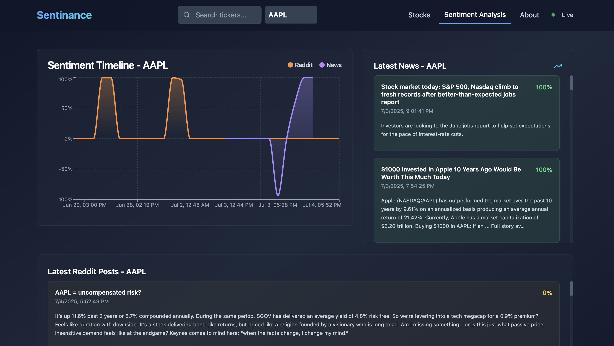

# Sentinance: Stock Market Sentiment Analysis Platform

Sentinance is a full-stack, real-time sentiment and event tracking platform for retail stock traders and small fund managers. It aggregates Reddit (and soon Twitter/News) data to provide real-time sentiment graphs, event detection, and custom alerts for stock tickers.

## 🚀 Features
- **Real-time sentiment analysis** for stocks using Reddit data
- **Interactive dashboard** with sentiment timelines, heatmaps, and trending mentions
- **Backend API** (FastAPI) with NLP pipeline (FinBERT)
- **Frontend** (React + Vite + TailwindCSS) with live data visualizations
- **Modular, extensible codebase** for future Twitter/News integration

## 🧱 Tech Stack
- **Frontend:** React, Vite, TailwindCSS, Recharts
- **Backend:** Python, FastAPI, PRAW (Reddit API), HuggingFace Transformers (FinBERT)
- **Database:** (Planned) PostgreSQL, Redis, Pinecone/Weaviate
- **DevOps:** Docker, GitHub Actions (planned)

## 🌐 How It Works
- The frontend fetches live sentiment data from the backend API (e.g., `/sentiment/reddit?ticker=AAPL`).
- The backend scrapes Reddit for posts about the ticker, runs sentiment analysis, and returns results to the frontend.
- The dashboard visualizes this data in real time.

## 🏗️ Planned Features
- Twitter and News integration
- Semantic search and event detection
- Custom alerts and notifications
- User authentication and personalized dashboards

## 🖼️ Demo
*Coming soon!*
